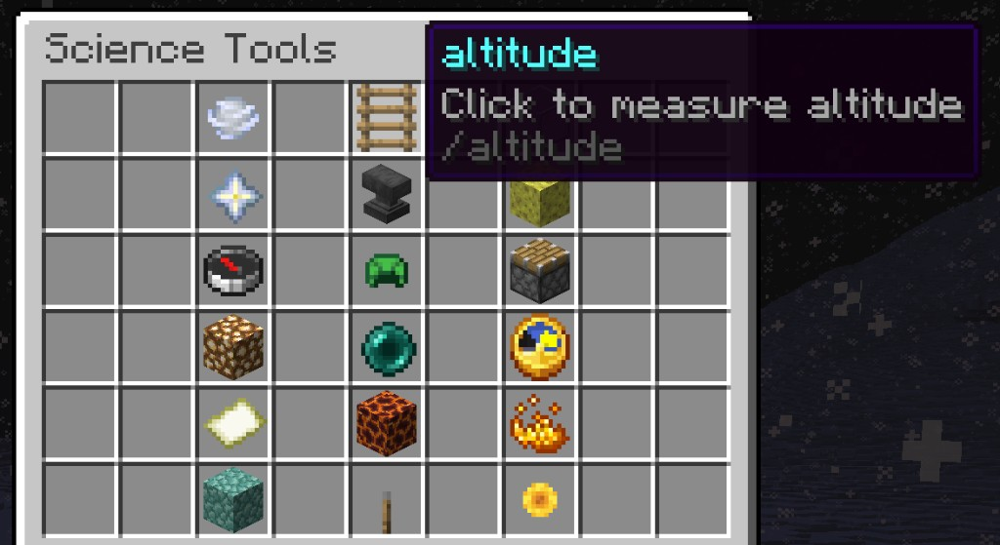

# WHIMC-ScienceTools

ScienceTools is a Minecraft plugin to simulate values for scientific tools. This plugin uses [WorldGuard](https://worldguard.enginehub.org/en/latest/developer/dependency/) to define regions in which to set scientific values. To set values, edit the config file.

## Example Science Tools in use on WHIMC

- **Altitude** (`ALTITUDE`) — altitude/height
- **Airflow** (`AIRFLOW`) — wind speed and airflow
- **Atmosphere** (`ATMOSPHERE`) — atmospheric composition (nitrogen, oxygen, methane, etc.). `/oxygen` and `/o2` are aliases.
- **Gravity** (`GRAVITY`) — gravitational pull
- **Humidity** (`HUMIDITY`) — humidity / water vapor
- **Magnetic Field** (`MAGNETIC_FIELD`) — magnetic field strength
- **Pressure** (`PRESSURE`) — atmospheric pressure
- **Radiation** (`RADIATION`) — overall radiation exposure
- **Cosmic Rays** (`COSMICRAYS`) — galactic cosmic ray exposure
- **Radius** (`RADIUS`) — planetary radius
- **Rotational Period** (`ROTATIONAL_PERIOD`) — length of a day / rotation period
- **Tectonic Activity** (`TECTONIC`) — seismic and tectonic activity
- **Temperature** (`TEMPERATURE`) — ambient temperature
- **Tides** (`TIDES`) — tidal variance
- **Tilt** (`TILT`) — axial tilt
- **Year** (`YEAR`) — orbital period (length of a year)
- **Scale** (`SCALE`) — scale/size measurement

***Requires Java 11+***

---


## Building

Build the source with Maven:

```
$ mvn install
```

---


## Configuration

The config file can be found under `/plugins/WHIMC-ScienceTools/config.yml`. Use `/sciencetools reload` whenever you change the config.

### MySQL

In order to track the history of science tool usage, you have to connect to a SQL database.


| Key              | Type      | Description                     |
| ---------------- | --------- | ------------------------------- |
| `mysql.enabled`  | `boolean` | Whether to use a SQL database   |
| `mysql.host`     | `string`  | The host of the database        |
| `mysql.port`     | `integer` | The port of the database        |
| `mysql.database` | `string`  | The name of the database to use |
| `mysql.username` | `string`  | Username for credentials        |
| `mysql.password` | `string`  | Password for credentials        |


#### Example

```yaml
mysql:
  enabled: true
  host: localhost
  port: 3306
  database: minecraft
  username: user
  password: pass
```


### Messages

Messages can have either global or tool-specific scope. The global config messages should define all message types. Tool-specific config messages do not need to define all message types, and will default to the global messages config if an undefined message type is needed to display to the player.

Messages config will look like this:

```yaml
messages:
  # The measure message to display
  measure-format: 
  # The numerical measure message to display
  numeric-measure-format: 
  # The disabled world message to display 
  disabled-in-world: 
```

Example for global config messages:

```yaml
messages:
  measure-format: '{MEASUREMENT}'
  numeric-measure-format: 'The measured {TOOL} is {MEASUREMENT}{UNIT}'
  disabled-in-world: "We don't know how to measure that here"
```

Example for tool-specific config messages:

```yaml
tools:
  ALTITUDE:
    display-name: "altitude"
    messages:
      disabled-in-world: "{TOOL} cannot be measured here"
```


#### Placeholders


| Placeholder     | Description                                          |
| --------------- | ---------------------------------------------------- |
| `{MEASUREMENT}` | The measurement of the tool at the player's position |
| `{TOOL}`        | The display name of the tool                         |
| `{UNIT}`        | The unit of the tool measurement                     |


### Unit Conversions

Unit conversions config will look like this:

```yaml
conversions:
  # The name of the conversion 
  conversion_name:
    # The expression that will be used to convert the value
    expression: "{VAL} * 1.0"
    # The unit of the conversion
    unit: "unit"
    # Decimal places to show for this unit (optional, defaults to 3)
    precision: 3
```

Example:

```yaml
conversions:
  fahrenheit: # Celsius -> Fahrenheit
    expression: "({VAL} * 9.0 / 5.0) + 32.0"
    unit: "°F"
    precision: 1
  feet: # Meters -> Feet
    expression: "{VAL} * 3.28084"
    unit: "ft"
    precision: 1
  gravityearth:
    expression: "{VAL} * 0.09807"
    unit: " m/s^2"
    precision: 3
```


#### Placeholders


| Placeholder | Description                       |
| ----------- | --------------------------------- |
| `{VAL}`     | The value that is being converted |


### Science Tools

A science tool can either be string-based or numeric. The `default-measurement` will determine this behavior.
If the `default-measurement` is valid JavaScript syntax, the tool will be considered numeric.
Numeric science tools have extra options for configuration.

String-based science tool example:

```yaml
tools:
  # The tool key
  STRING_TOOL:
    # (optional: defaults to the tool key) A formatted version of the tool
    # Keep this to about 24 characters (three short words) so it fits the title line
    display-name: "String Tool"
    # The default fallback measurement to be used
    default-measurement: "Value"
    # (optional) World settings
    worlds:
      # Name of the world to configure
      WorldName:
        # (optional: Defaults to `default-expression`)
        #  The fallback measurement for this world
        global-measurement: "Value within worldName"
        # (optional) Region-specific measurements
        regions:
          region1: "Value within region1"
          region2: "Value within region2"
    # (optional) List of worlds where this tool cannot be measured
    disabled-worlds:
      - disabledWorld1
      - disabledWorld2
```

Numeric science tool example:

```yaml
tools:
  NUMERIC_TOOL:
    display-name: "Numeric Tool"
    default-measurement: "1 + 1"
    
    # The following are for numeric science tools only!

    # The unit of the tool
    unit: "m"
    # The number of decimals to show in the printout
    precision: 4
    # A list of conversions that will be showed with the tool's printout
    conversions:
      - conversion_name
```

Region names are defined using [WorldGuard](https://worldguard.enginehub.org/en/latest/regions/commands/).

#### Placeholders


| Placeholder         | Description                                          |
| ------------------- | ---------------------------------------------------- |
| `{X}`               | The player's current X position                      |
| `{Y}`               | The player's current Y position                      |
| `{Z}`               | The player's current Z position                      |
| `{TIME_TICKS}`      | The time of the world in ticks                       |
| `{NIGHT}`           | `0` if daytime, `1` otherwise                        |
| `{WEATHER}`         | `0` if the weather is clear, `1` otherwise           |
| `rand(min, max)`    | A random decimal between `min` and `max` (inclusive) |
| `randInt(min, max)` | A random integer between `min` and `max` (inclusive) |
| `min(a, b)`         | The minimum between `a` and `b`                      |
| `max(a, b)`         | The maximum between `a` and `b`                      |
| `{<tool key>}`      | The value from the given *numeric* tool              |


### Validation

Validation config will look like this:

```yaml
validation:
  # Amount of 'wiggle room' given when accepting answers
  tolerance: 10
  # time (in seconds) until timeout
  timeout: 30
  messages:
    prompt:
      all:
        - '&8> The message to send'
        - '&8> The next line of the message to send'
      TOOLNAME:
        - '&8> The message to send'
    timeout:
      all:
        - '&8> The message to send'
      TOOLNAME:
        - '&8> The message to send'
    no-number:
      all:
        - '&8> The message to send'
      TOOLNAME:
        - '&8> The message to send'
    found-number:
      all: []
    success:
      all:
        - '&8> The message to send'
      TOOLNAME:
        - '&8> The message to send'
    failure:
      all:
        - '&8> The message to send'
      TOOLNAME:
        - '&8> The message to send'
  commands:
    prompt:
      all: []
    timeout:
      all: []
    no-number:
      all: []
    found-number:
      all: []
    success:
      all: []
      TOOLNAME:
        - "The action"
```

Example Using [Quests](https://github.com/PikaMug/Quests):

```yaml
validation:
  tolerance: 1.0
  timeout: 30
  messages:
    prompt:
      all:
        - '&8>'
        - '&8> &7&lData Entry Computer &7&o(v2.0)'
        - '&8>'
        - '&8>   &7Current {TOOL}: &8Unknown'
        - '&8>'
        - '&8>   &7Please type the {TOOL} value you just measured:'
        - '&8>'
    timeout:
      all:
        - '&8>'
        - '&8> &7Computer left idle.'
        - '&8> &7Logging off... Goodbye!'
        - '&8>'
    no-number:
      all:
        - '&8> &cNo numbers detected!'
        - '&8> &7Click the computer to try again!'
    found-number:
      all: []
    success:
      all:
        - '&8> &7Value updated!'
        - '&8> &7Current {TOOL}: &a{VAL}{UNIT}'
    failure:
      all:
        - '&8> &e{VAL}{UNIT}&7 does not match the range of possible data.'
        - '&8> &7Click the computer to try again!'
      TEMPERATURE:
        - "&8>   &7If you're stuck, talk to &fMisavo&7 again!"
      PRESSURE:
        - "&8>   &7If you're stuck, talk to &fHarlem&7 again!"
      WIND:
        - "&8>   &7If you're stuck, talk to &fHuxley&7 again!"
      ATMOSPHERE:
        - "&8>   &7If you're stuck, talk to &fOlivia&7 again!"
  commands:
    prompt:
      all: []
    timeout:
      all: []
    no-number:
      all: []
    found-number:
      all: []
    success:
      all: []
      ALTITUDE:
      - "questadmin nextstage {PLAYER} Ice on Fire!"
      TEMPERATURE:
      - "questadmin nextstage {PLAYER} What's Cooler Than Being Cool?"
      PRESSURE:
      - 'questadmin nextstage {PLAYER} Feeling the Pressure'
      WIND:
      - 'questadmin nextstage {PLAYER} Not-So-Solar-Wind'
      ATMOSPHERE:
      - 'questadmin nextstage {PLAYER} A Breath of Fresh Air'
      RADIATION:
      - 'questadmin nextstage {PLAYER} Seas of Lava?'
```


#### Placeholders


| Placeholder | Description                      |
| ----------- | -------------------------------- |
| `{TOOL}`    | The current science tool         |
| `{VAL}`     | The provided value               |
| `{UNIT}`    | The current science tool's units |
| `{PLAYER}`  | The target player                |


---


## Example Science Tools Types, Measurements and Explanations

[Current WHIMC science tools reference / documentation](https://docs.google.com/document/d/1oX_dHe5SZlKkCxq8a6GdmYuBZfBZeIqgQFrVwMwR3E8/edit?usp=sharing)

## Science Tools GUI (Tricorder)

Right-click a glowing **Tricorder** (an Observer) to open a chest GUI of every loaded science tool. Hover an icon for a short explanation of what it measures; **left-click** to measure at your current location. The GUI closes so the result can show on screen as two lines: the tool name (title) and the reading plus unit (subtitle). Minecraft only draws one line per slot, so a newline inside the title or subtitle is dropped. Chat is off by default. **Shift-click** a numeric tool to cycle its display unit. A book in the top-left shows your last 5 measurements; left-click it to print them in chat. Requires `sciencetools.user`.

There is a 5-second cooldown per tool (`gui.measure-cooldown-seconds`). Operators can hide tools in the GUI per world with `/sciencetools hide` (commands like `/gravity` still work).



A regular Observer does not open the GUI. Only the named Tricorder item does.

### Locked hotbar item

Operators can give every player a **Tricorder**. Locked mode keeps it in **hotbar slot 9** (cannot drop, move, or lose it on death). Unlock mode still gives the item on join and after reload, but players can move or drop it.

| Command | Description |
| ------------------------- | ----------------------------------------------------------------------------------- |
| `/tricorder on` | Give every online player a locked Tricorder and give it to players who join later |
| `/tricorder unlock` | Give the Tricorder but let players move or drop it |
| `/tricorder off` | Remove it from everyone and stop giving it on join |
| `/tricorder on <player>` | Locked Tricorder for one online player this session |
| `/tricorder unlock <player>` | Unlocked Tricorder for one online player this session |
| `/tricorder off <player>` | Remove it from one player |

`/tricorder` requires `sciencetools.admin`. The global mode is saved as `gui.tricorder-mode` (`off`, `locked`, or `unlocked`).

### Measurement display

After a successful measure, the plugin can show the reading on screen, in chat, or both. Minecraft can draw two lines (title + subtitle) but only one line in each slot; extra line breaks are ignored. Keep each tool `display-name` to about **24 characters** (three short words), or the title line will clip. The sample names (`atmospheric composition`, `gravitational pull`) are a good length.

| Key | Default | What it does |
| --- | --- | --- |
| `gui.show-on-screen` | `true` | Tool name on the title line, reading and unit on the subtitle line |
| `gui.show-in-chat` | `false` | The usual chat measurement line |

Errors still go to chat (cooldown, tool disabled in this world, unknown tool). Clicking the last-5 book still prints history in chat. Measurements are still stored for Quests and MySQL either way.

### Misspelled tool names

Kids can type a close spelling of a tool command. `/amisfer` is rewritten to `/atmosphere`. The matcher uses the tool key, aliases, and words from the display name (so “atmospheric” also points at Atmosphere). If two tools are equally close, chat asks **Did you mean /radius?** with clickable names. `/sciencetools measure` uses the same matching.

### Hiding tools in the GUI

`gui.hidden` only removes icons from the Tricorder. `/gravity` and the other tool commands still work.

```yaml
gui:
  hidden:
    all:
      - SCALE              # hidden in every world
      - COSMICRAYS
    RocketLaunch:          # extra tools hidden only in this world
      - ALTITUDE
      - GRAVITY
      # ...every tool, so the Tricorder is empty on RocketLaunch
```

`all` is not a Minecraft world. It is the global list. The sample config hides **Scale** and **Cosmic Rays** everywhere and hides **every tool** on `RocketLaunch`. A world name key hides extra tools only in that world. A tool listed under both `all` and a world is hidden in that world either way.

| Command | Effect |
| --- | --- |
| `/sciencetools hide SCALE all` | Hide Scale in the GUI on every world |
| `/sciencetools hide YEAR Hub` | Hide Year in the GUI only on Hub |
| `/sciencetools show SCALE all` | Put Scale back on the global list |
| `/sciencetools hide SCALE` | Hide Scale in the sender’s current world |

`/sciencetools hide` and `show` require `sciencetools.admin` and write back to `config.yml`.

### GUI configuration


| Key | Description |
| ------------------ | ----------------------------------------------------------------- |
| `gui.enabled` | Whether right-clicking the Tricorder opens the GUI |
| `gui.trigger-item` | Material for the Tricorder (default `OBSERVER`) |
| `gui.item-name` | Display name used to identify the Tricorder (default `Tricorder`) |
| `gui.tricorder-mode` | `off`, `locked`, or `unlocked` (sample default `locked`) |
| `gui.locked-item` | Legacy flag; `true` means locked if `tricorder-mode` is missing |
| `gui.measure-cooldown-seconds` | Wait time before measuring the same tool again (default `5`) |
| `gui.show-on-screen` | Tool name on the title line, reading and unit on the subtitle (default `true`) |
| `gui.show-in-chat` | Print the measurement in chat (default `false`) |
| `gui.title` | Chest GUI title |
| `gui.items` | Material for each tool icon |
| `gui.lore` | Short hover-text explanation for each tool |
| `gui.hidden` | Tools to omit from the GUI. `all` is every world (not a world name). Sample hides Scale and Cosmic Rays everywhere and every tool on RocketLaunch |


Icons sit three per row with a gap between each. Radius uses an **Ender Pearl**; magnetic field still uses a Compass.

## Commands


| Command                                                      | Description                                                        |
| ------------------------------------------------------------ | ------------------------------------------------------------------ |
| `/sciencetools`                                              | Display command help                                               |
| `/sciencetools validate <tool> <player>`                     | Take the value of the tool at the target player's current location |
| `/sciencetools validate <tool> <player> <world> <x> <y> <z>` | Take the value of the tool at the provided location                |
| `/sciencetools reload`                                       | Reload the plugin's config                                         |
| `/sciencetools js`                                           | Run interpreted JavaScript                                         |
| `/sciencetools hide <tool> [world\|all]` | Hide a tool in the Tricorder GUI for a world |
| `/sciencetools show <tool> [world\|all]` | Show a hidden tool in the Tricorder GUI |
| `/tricorder on|off|unlock [player]`                          | Give, unlock, or remove the Tricorder                              |


 

Using `/atmosphere` (also `/oxygen` or `/o2`) when standing on LunarCrater (outdoors)
on our server reports that there is no detectable atmosphere. Indoors, the same
tool describes the station air mix (nitrogen, oxygen, and other gases).

Using `/sciencetools validate PRESSURE MyName LunarCrater 40 22 37` 
on our server will open a data entry computer prompt in the chat that accepts a
value (input by typing a number in the chat). It will want a value 101.30kPa since
the specified coordinates are in a specific building with a different pressure
than the outside (0kPa).

---


## Dependencies

- [WorldGuard](https://worldguard.enginehub.org/en/latest/developer/dependency/)
- Multiverse-Core (optional; listed as a soft dependency so planetary worlds are loaded before tools)

